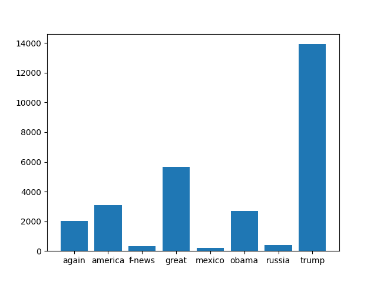

## Donald Trump's tweets analysis

Note: The python file is in the folder 'data' 

phrase | percent of tweets | 
--- | --- |
america | 08.54 |
again | 05.61 | 
fake news | 00.92
great | 15.64
mexico | 00.55
obama | 07.47
russia | 01.13
trump | 38.35

The graph presents how many times each word occur in Donald Trump's tweets from year 2009 to year 2018. 
